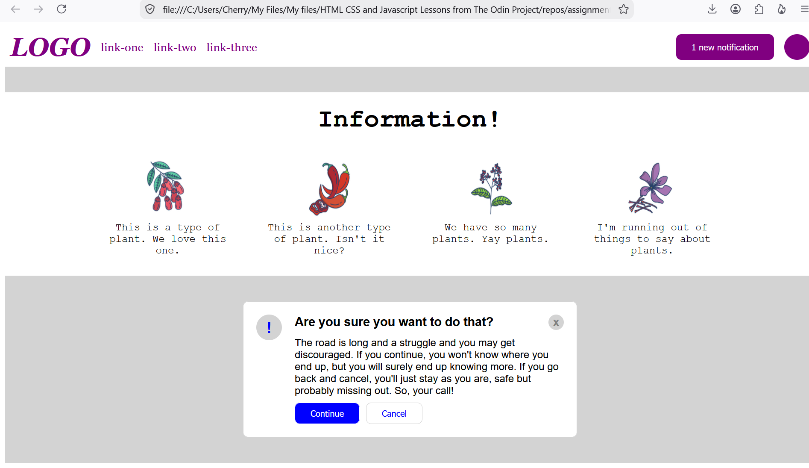

# WebDevelopmentTOPFlex3-4-5
Flex foundations - headers and modal combined

### Description
This is NOT an automation testing practice.
This is web development practice assignment from The Odin Project.

Using HTML and CSS with VSCode.

Flexbox Alignment assignments 3, 4, 5 combined in one web page. Not only did I take liberties with the instructions by putting different assignments in one page, I also went ahead and replaced the text placeholder.

Thank you to The Odin Project.

